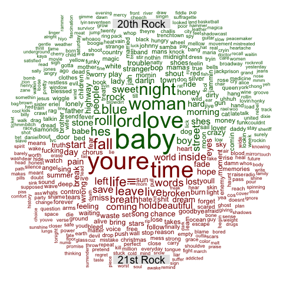

```{r setup, include=FALSE}
knitr::opts_chunk$set(echo = TRUE)
```

##### Step 0a.Load all the required libraries

+ `tm` is a framework for text mining applications within R;
+ `tidyverse` is an opinionated collection of R packages designed for data science. All packages share an underlying design philosophy, grammar, and data structures;
+ `tidytext` allows text mining using 'dplyr', 'ggplot2', and other tidy tools;
+ `wordcloud` creates word cloud;
+ `stargazer` creates well-formatted regression and summary statistics tables;
+ `RColorBrewer` provides more options about ColorBrewer Palettes;
+ `topicmodels` topic modeling

```{r load libraries, warning=FALSE,message=FALSE}
library(tm)
library(tidyverse)
library(tidytext)
library(wordcloud)
library(stargazer)
library(RColorBrewer)
library(topicmodels)
```

##### Step 0b.Load the **processed data** with cleaned stemmedwords
```{r load data}
load("~/Google Drive (zz2587@columbia.edu)/fall2019-proj1--zzzaaannn-master/output/processed_lyrics.RData")
```

```{r correct typos}
# There are two typos of *year*, so correct them 
dt_lyrics[which(dt_lyrics$year==702, arr.ind = TRUE),2] <- 2002
dt_lyrics[which(dt_lyrics$year==112, arr.ind = TRUE),2] <- 1998
glimpse(dt_lyrics)
```


<br />
<br />


We are now in the end of second decade of 21st century. Thanks to advances in every sectors such as technology and transportation, people are living more convenient, efficient and colorful. Back to 20th century, it was hard to imagine that over 95% Americans would own a cell phone in future. Surprisingly, cell phones with keyboards fade and out, and almost everyone is using a large screen cell phone. Not only time and technology are changing rapidly, but also habits can change. 

Would lyrics be different between 20th century and 21st century? Do 21st-century singers still write the similar lyrics as the past?

To answer these questions, my goal is to i)analyze the evolution of lyrics by its length, ii)compare the frequent stemmed words between centuries and examine stemmed words for genres, iii) deeper analyze topics of genres in different centuries using topic modeling


-----------------------------------------------------------------------------------------------------------

### How about length of lyrics?
```{r length}
# use the original lyrics to count words instead of stemmed words
song_wrd_count <- dt_lyrics %>% 
  select(id,song,year,genre,lyrics) %>% 
  unnest_tokens(input = lyrics,output = word) %>% 
  group_by(id) %>% 
  mutate(wrd_count = n()) %>% 
  distinct(id,.keep_all = TRUE) %>% 
  select(-word)
# compute the average number of words for each year
# using sum of words / sum of number of songs for each year
avg_yr_wrd_count <- song_wrd_count %>% 
  group_by(year) %>% 
  summarise(num_song =length(song),
            num_wrd = sum(wrd_count)) %>% 
  mutate(avg_wrd_yr = num_wrd / num_song) %>% 
  arrange(desc(avg_wrd_yr)) 

# time series plot of length of lyrics
avg_yr_wrd_count %>% 
  ggplot(aes(x=year,y = avg_wrd_yr))+
  geom_line() +
  labs(title = "Time evolution for length of lyrics",
       y = "Average Words",x = "")+
  theme(plot.title = element_text(hjust = 0.5),
        panel.grid.major = element_blank())
```

The plot shows an outlier of Year 1968, which was caused by lack of data. Dataset only has one song in 1968. Other than that, there is a slightly upward trend of length of lyrics. Clearly, there exists rises and falls in the data values, which seems to be a seasonal pattern.


```{r boxplot}
# divide lyrics into two parts: 20th century and 21st century by variable year 
a <- avg_yr_wrd_count %>% 
  filter(year <= 2000) %>% 
  select(avg_wrd_yr) %>% 
  mutate(century = "20th")
b <- avg_yr_wrd_count %>% 
  filter(year > 2000) %>% 
  select(avg_wrd_yr) %>% 
  mutate(century = "21st")
ab <- rbind(a,b)
ggplot(data = ab,aes(x=century, y = avg_wrd_yr,color = century)) + 
  geom_boxplot()+
  labs(title = "",
       y = "Average Words",x = "")+
  theme(plot.title = element_text(hjust = 0.5),
        panel.grid.major = element_blank())
```

According to the boxplot above, we can verify that 21st century has longer lyrics than 20th century.

----------------------------------------------------------------------------------


### How about the frequent *stemmed words*?
```{r}
# divide lyrics into two parts: 20th century and 21st century by variable year 
lyrics_before_2000 <- dt_lyrics %>% 
  filter(year <=2000) %>% 
  select(stemmedwords)

lyrics_after_2000 <- dt_lyrics %>% 
  filter(year >2000) %>% 
  select(stemmedwords)
```


+ Frequent terms in the 20th century

```{r 20th histogram}
# compute the frequent terms in the 20th century
before_2000_corpus <- VCorpus(VectorSource(lyrics_before_2000))
before_2000_tdm <- TermDocumentMatrix(before_2000_corpus)
before_2000_m <- as.matrix(before_2000_tdm)
before_2000_freq <- sort(rowSums(before_2000_m),decreasing = TRUE)

ggplot() + 
  geom_col(aes(x=reorder(names(before_2000_freq)[1:10],before_2000_freq[1:10]),y=before_2000_freq[1:10]),fill = "blue")+
  theme(plot.title = element_text(hjust = 0.5),
        panel.grid.major = element_blank()) +
  xlab("") + 
  ylab("Terms Count") +
  ggtitle("20th Century Most Frequently Used Words in Lyrics") +
  coord_flip()
```

The histogram of 20th century shows that the most frequently used words are **love, time, baby, youre**.

+ Frequent terms in the 21st century
```{r 21st histogram}
# compute the frequent terms in the 21st century
after_2000_corpus <- VCorpus(VectorSource(lyrics_after_2000))
after_2000_tdm <- TermDocumentMatrix(after_2000_corpus)
after_2000_m <- as.matrix(after_2000_tdm)
after_2000_freq <- sort(rowSums(after_2000_m),decreasing = TRUE)

ggplot() + 
  geom_col(aes(x=reorder(names(after_2000_freq)[1:10],after_2000_freq[1:10]),y=after_2000_freq[1:10]),fill = "blue")+
  theme(legend.position = "none", 
        plot.title = element_text(hjust = 0.5),
        panel.grid.major = element_blank()) +
  labs(x = "",y = "Terms Count", 
       title = "21st Century Most Frequently Used Words in Lyrics" )+
  coord_flip()
```

The histogram of 21st century shows that the most frequently used words are **love, time, youre, baby**.

```{r}
# put all the lyrics into one corpus with two documents
# one document comes from 20th century, the other comes from 21st century
bb <- paste(lyrics_before_2000, collapse = "")
aa <- paste(lyrics_after_2000,collapse = "")
all <- c(bb,aa)
all_corpus <- VCorpus(VectorSource(all))
# compute frequent terms
all_tdm <- TermDocumentMatrix(all_corpus)
colnames(all_tdm) <- c("20th","21st")
all_m <- as.matrix(all_tdm)
common_words <- subset(all_m,
                       all_m[,1]>0 & all_m[,2]>0
)
# terms in order with differences
difference <- abs(common_words[, 1] - common_words[, 2])
common_words <- cbind(common_words, difference)
common_words <- common_words[order(common_words[, 3],
                                   decreasing = T), ]
# use proportion of words to compare instead of counts
# 21st century has more songs than 20th century, thus larger number of counts.
# proportion can make plot looks nicer
prop_20 <- common_words[,1]/sum(common_words[,1])
prop_21 <- common_words[,2]/sum(common_words[,2])

common_words_20 <- data.frame(terms =rownames(common_words)[1:25],
                              count =prop_20[1:25],
                              century = rep("20th",25))
common_words_21 <- data.frame(terms =rownames(common_words)[1:25],
                              count = prop_21[1:25],
                              century = rep("21st",25))
```

```{r}
# combine into one dataframe for pyramid plot
top25_df <- rbind(common_words_20,common_words_21)
ggplot(data = top25_df,
       mapping = aes(x =reorder(terms,count),
                     y = ifelse(century=="20th",-count,count),
                     fill = century))+
  geom_bar(stat = "identity") +
  scale_y_continuous(labels = abs)+
  theme(plot.title = element_text(hjust = 0.5),
        panel.grid.major = element_blank()) +
  labs(x = "",y = "Propotion of Terms Count", 
       title = "Most Frequently Used Words in Lyrics" )+
  coord_flip()
```


Interestingly, from the histogram, we can see that **youre** is getting more popular than **baby** . This confirms that songs of 21st century are predominantly about *someone* as you're has significant number of occurrences.

```{r yrwordcloud function}
yrwordcloud <- function(data){
  data_corpus <- VCorpus(VectorSource(data))
  data_tdm <- TermDocumentMatrix(data_corpus)
  data_m <- as.matrix(data_tdm)
  data_freq <- sort(rowSums(data_m),decreasing = TRUE)
  wordcloud(names(data_freq),data_freq,
            max.words = 100,
            scale = c(10,0.2),
            rot.per = 0.15,
            random.order = FALSE, 
            colors = brewer.pal(8,"Dark2"))
}
```

```{r 20th wordcloud}
# save the pic for nicer presentation
png("stem_20.png")
yrwordcloud(lyrics_before_2000$stemmedwords)
```

```{r 21st wordcloud}
png("stem_21.png")
yrwordcloud(lyrics_after_2000)
```
The resulting word clouds (left 20th century and right 21st century) show that the most frequently used words are **love, time, youre, baby**. 

{width=45%} {width=45%}

+ Comparison of frequent words 

```{r comparison cloud}
png("all_m.png")
comparison.cloud(all_m,random.order = FALSE, 
            title.size = 1.5,
            colors = c("darkgreen","darkred"),
            max.words = 500)

```
<center>


</center>

According to comparison cloud, we can see that in the 20th century, love and baby are the dominant words in lyrics while besides the most frequent words, other words are distributed evenly in the 21st century,. 

----------------------------------------------------------------------------------

### How about lyrics between genres? 
```{r}
genre_list <- c("Folk", "R&B", "Electronic", "Jazz", "Indie", "Country", "Rock", "Metal", "Pop", "Hip-Hop", "Other")
lyrics_before_2000 <- dt_lyrics %>% 
  filter(year <=2000)
lyrics_after_2000 <- dt_lyrics %>% 
  filter(year >2000)

# list of genres 
before_2000 <- list()
after_2000 <- list()
for (i in 1:length(genre_list)) {
  before_2000[[i]] <- lyrics_before_2000[lyrics_before_2000$genre == genre_list[i],"stemmedwords"]
  after_2000[[i]] <- lyrics_after_2000[lyrics_after_2000$genre == genre_list[i],"stemmedwords"]
}

# choose each genre and comparison&commonality wordcloud the genre between centuries
for (i in 1:length(genre_list)) {
  corpus <- Corpus(VectorSource(c(before_2000[i],after_2000[i])))
  tdm <- TermDocumentMatrix(corpus)
  m <- as.matrix(tdm)
  colnames(m) <- c(paste("20th",genre_list[i]),paste("21st",genre_list[i]))
  # save pic for nicer presentation
  file = paste("comparison",genre_list[i],".png",sep = "")
  png(filename = file)
  comparison.cloud(m,random.order = FALSE, 
            title.size = 1.5,
            colors = c("darkgreen","darkred"),
            max.words = 500)
  dev.off()
  # save pic for nicer presentation
  file = paste("commonality",genre_list[i],".png",sep = "")
  png(filename = file)
  commonality.cloud(m, max.words = 100,
            scale = c(10,0.2),
            rot.per = 0.15,
            random.order = FALSE, 
            colors = brewer.pal(8,"Dark2"))
  dev.off()
}
```

Here are some interesting findings.

<br />

For **similarities**, notice that 
<br />
1. Every type of genre has a common word **love**, except metal songs. Metal genre prefers **life** and **time**. 
<br />
2. **Hip-Hop** music likes to use emotional intensity words such as "shit" and "bitch".
<br />
3. In our dataset, there is no song of genre **Indie** for the 20th century. I guess this is because Indie music rises at the end of 20th century or the beginning of 21st century. Indie music is new to us. 

Metal(Left)   Other(Right)
{width=40%} {width=40%}

Country(Left)   Folk(Right)
{width=40%} {width=40%}

Electronic(Left)   Jazz(Right)
{width=40%} {width=40%}

Hip-Hop(Left)   Pop(Right)
{width=40%} {width=40%}

R&B(Left)   Rock(Right)
{width=40%} {width=40%}


<br />

For **differencies**, all the comparsion clouds are uploaded on the *output* folder.

Here provide some findings

<br />
1.21st century Country music tends to use love word.

<center>

 

</center>

<br />
2.20th century Folk music likes word Christmas in the songs.

<center>
 
 
</center>

<br />
3. There are many differences on choosing words for Rock music.

<center>

 
 
</center>

----------------------------------------------------------------------------------

<br />

### How about topics between Country, Folk and Rock? (Topic Modeling)

Based on intriguing comparison results of genre country, folk and rock, we dig deeper to see differences in each themes of those genres using topic modeling. 


```{r filter data}
lyrics_before_2000 <- dt_lyrics %>% 
  filter(year <=2000)

lyrics_after_2000 <- dt_lyrics %>% 
  filter(year >2000) 
```

+ 20th Folk

```{r}
#Set parameters for Gibbs sampling
burnin <- 4000
iter <- 2000
thin <- 500
seed <-list(2003,5,63,100001,765)
nstart <- 5
best <- TRUE
#Number of topics
k <- 5
# dtm
lda.mod <- function(data,genre){
  df <- data[data$genre == genre,c("stemmedwords","id")]
  dtm <- df %>% 
   unnest_tokens(input = stemmedwords,
                 output = word,
                 drop = TRUE) %>% 
   count(id,word) %>% 
   cast_dtm(document = id, term = word, value =n)
#Run LDA using Gibbs sampling
  mod <-LDA(dtm, k, method="Gibbs", 
            control=list(nstart=nstart,seed = seed,
                         best=best,burnin = burnin,
                         iter = iter,thin=thin))
  return(mod)
}
```


```{r}
folk_20_lda <- lda.mod(lyrics_before_2000,"Folk")
terms(folk_20_lda,10) #top 10 terms in each topic
```

Based on the most popular terms and the most salient terms for each topic, hashtags are assigned to each topic. This part require manual setup as the topics are likely to change.

```{r}
topics.hash = c("christmas","life","love","carefree","holiday")

modout <- tidy(folk_20_lda,matrix = "beta") %>% 
    group_by(topic) %>% 
    top_n(10,beta) %>% 
    ungroup() %>% 
    arrange(topic,-beta) %>% 
    mutate(hash = topics.hash[topic]) 

 ggplot(data = modout, aes(reorder(term,beta),beta,fill=factor(hash))) +
    geom_col(show.legend = FALSE) +
    facet_wrap(~hash,scales = "free")+
    coord_flip() +
    scale_x_reordered()
```


+ 21st Folk


```{r}
folk_21_lda <- lda.mod(lyrics_after_2000,"Folk")
terms(folk_21_lda,10)
```

Based on the most popular terms and the most salient terms for each topic, hashtags are assigned to each topic. This part require manual setup as the topics are likely to change.

```{r}
topics.hash = c("dream","event","love","relationship","day")

modout <- tidy(folk_21_lda,matrix = "beta") %>% 
    group_by(topic) %>% 
    top_n(10,beta) %>% 
    ungroup() %>% 
    arrange(topic,-beta) %>% 
    mutate(hash = topics.hash[topic]) 

 ggplot(data = modout, aes(reorder(term,beta),beta,fill=factor(hash))) +
    geom_col(show.legend = FALSE) +
    facet_wrap(~hash,scales = "free")+
    coord_flip() +
    scale_x_reordered()
```

21st Folk musicians write different topics. They focus on personal events rather than holiday and national culture compared to 20th century.


+ 20th Country
```{r}
country_20_lda <- lda.mod(lyrics_before_2000,"Country")
terms(country_20_lda,10)
```

Based on the most popular terms and the most salient terms for each topic, hashtags are assigned to each topic. This part require manual setup as the topics are likely to change.

```{r}
topics.hash = c("love","region","the south","relationship","nostalgia")

modout <- tidy(country_20_lda,matrix = "beta") %>% 
    group_by(topic) %>% 
    top_n(10,beta) %>% 
    ungroup() %>% 
    arrange(topic,-beta) %>% 
    mutate(hash = topics.hash[topic]) 

 ggplot(data = modout, aes(reorder(term,beta),beta,fill=factor(hash))) +
    geom_col(show.legend = FALSE) +
    facet_wrap(~hash,scales = "free")+
    coord_flip() +
    scale_x_reordered()
```

+ 21st Country

```{r}
country_21_lda <- lda.mod(lyrics_after_2000,"Country")
terms(country_21_lda,10)
```

Based on the most popular terms and the most salient terms for each topic, hashtags are assigned to each topic. This part require manual setup as the topics are likely to change.

```{r}
topics.hash = c("mood","love","life","relationship","time")

modout <- tidy(country_21_lda,matrix = "beta") %>% 
    group_by(topic) %>% 
    top_n(10,beta) %>% 
    ungroup() %>% 
    arrange(topic,-beta) %>% 
    mutate(hash = topics.hash[topic]) 

 ggplot(data = modout, aes(reorder(term,beta),beta,fill=factor(hash))) +
    geom_col(show.legend = FALSE) +
    facet_wrap(~hash,scales = "free")+
    coord_flip() +
    scale_x_reordered()
```

Country music is originated in the southern United States and comes from the rural regions. However, the themes of 21st century Country music is not as classic as 20th century and begins to increasingly become a fusion of other genres such as pop and rock. 

+ 20th Rock

```{r}
rock_20_lda <- lda.mod(lyrics_before_2000,"Rock")
terms(rock_20_lda,10)
```

Based on the most popular terms and the most salient terms for each topic, hashtags are assigned to each topic. This part require manual setup as the topics are likely to change.

```{r}
topics.hash = c("love","relationship","life","social","emotion")

modout <- tidy(rock_20_lda,matrix = "beta") %>% 
    group_by(topic) %>% 
    top_n(10,beta) %>% 
    ungroup() %>% 
    arrange(topic,-beta) %>% 
    mutate(hash = topics.hash[topic]) 

 ggplot(data = modout, aes(reorder(term,beta),beta,fill=factor(hash))) +
    geom_col(show.legend = FALSE) +
    facet_wrap(~hash,scales = "free")+
    coord_flip() +
    scale_x_reordered()
```

+ 21st Rock

```{r}
rock_21_lda <- lda.mod(lyrics_after_2000,"Rock")
terms(rock_21_lda,10)
```

Based on the most popular terms and the most salient terms for each topic, hashtags are assigned to each topic. This part require manual setup as the topics are likely to change.

```{r}
topics.hash = c("personal","emotion","relationship","social","love")

modout <- tidy(rock_21_lda,matrix = "beta") %>% 
    group_by(topic) %>% 
    top_n(10,beta) %>% 
    ungroup() %>% 
    arrange(topic,-beta) %>% 
    mutate(hash = topics.hash[topic]) 

 ggplot(data = modout, aes(reorder(term,beta),beta,fill=factor(hash))) +
    geom_col(show.legend = FALSE) +
    facet_wrap(~hash,scales = "free")+
    coord_flip() +
    scale_x_reordered()
```

The themes of rock music is extremely diverse. Not only do they stress love, but also address a wide range of themes such as society and politics.

---------------------------------------------------------------------

### Summary 

+ Nowadays, singers tend to write more words than before on average. 

+ Whatever the century is, the most frequently used words are **love, time, baby, youre**.

+ In the 21st century **youre** is getting more popular than **baby**, which shows that songs of 21st century are predominantly about *someone*.

+ Every type of genre like using word **love** and the themes are about **love**.

+ **Indie** music is getting popular at the end of 20th century or the beginning of 21st century. Indie music is new to us. 

+ 21st century **Country** music is not as classic as 20th century.

+ The themes of **rock** are as diverse as it should be. 


 
